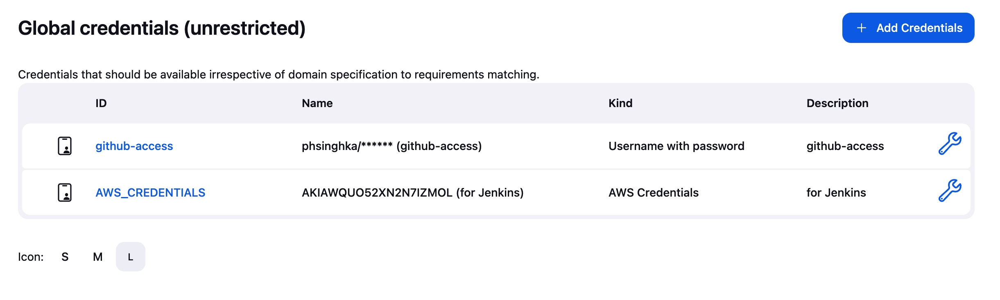
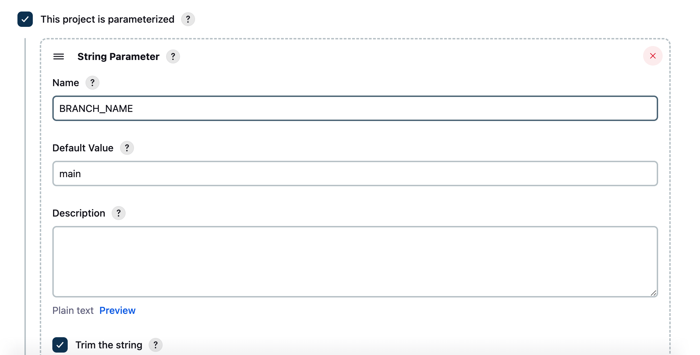
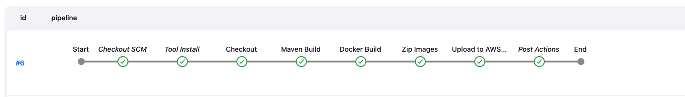
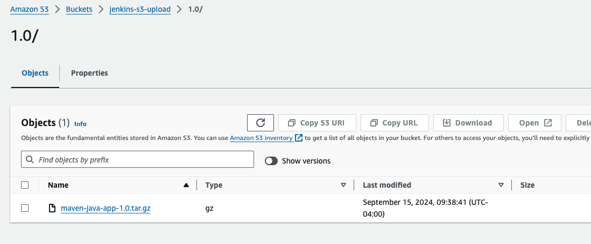

# Jenkins Pipeline: Maven Java App to AWS S3

This project demonstrates how to set up a Jenkins pipeline to:
1. Checkout code from a Git repository.
2. Build a Java Maven application.
3. Build Docker images for the application.
4. Zip the Docker images.
5. Upload the zipped Docker images to AWS S3.

## Prerequisites
- Jenkins installed and configured.
- AWS credentials with permissions to upload files to S3.
- GitHub repository with the source code.
- Docker installed on the Jenkins server.

## Pipeline Steps
1. **Git Checkout**: The pipeline checks out the source code from the specified branch in the GitHub repository.
2. **Maven Build**: Maven builds the project and generates a JAR file.
3. **Docker Build**: Docker images are created from the built JAR file.
4. **Zip Docker Images**: The built Docker images are zipped.
5. **Upload to S3**: The zipped Docker images are uploaded to an AWS S3 bucket.

## Screenshots

### 1. Jenkins Credentials Setup


### 2. Parameterized Build Setup


### 3. Pipeline Success


### 4. Uploaded Files in AWS S3


## Usage
1. Clone the repository:
   ```bash
   git clone https://github.com/phsinghka/jenkins-pipeline-to-s3.git
   ```

2. Add your AWS and GitHub credentials in Jenkins.
3. Configure the Jenkins pipeline using the provided `Jenkinsfile`.
4. Run the pipeline with appropriate parameters (`BRANCH_NAME`, `TAG_NAME`).
5. Check AWS S3 for the uploaded Docker image files and verify the Git tag.

## Technologies Used
- **Jenkins** for CI/CD pipeline.
- **Maven** for building the Java application.
- **Docker** for creating and managing container images.
- **AWS S3** for storing the zipped Docker images.
